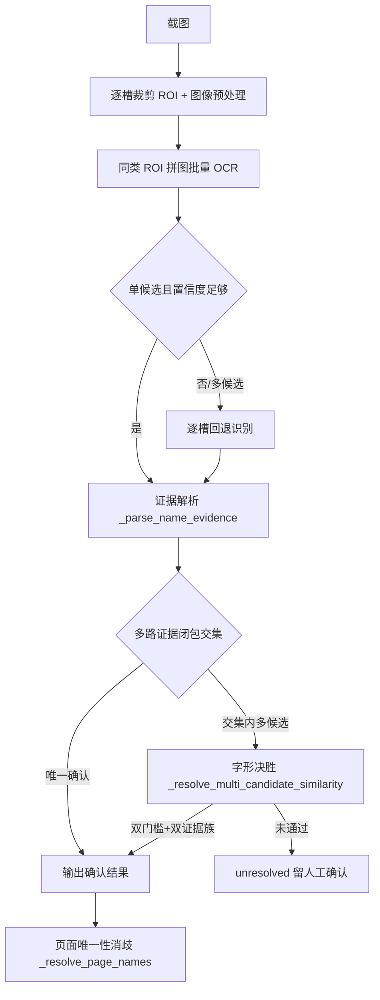

# OCR 武将名称纠错算法实现说明

> 适用范围：`src/ocr/recognizer.py` 的识别与证据解析、`src/ocr/character_similarity.py` 的纠错评分、`src/ocr/character_feature_repository.py` 的特征数据层、`src/business/recognition/official_data_import_service.py` 的榜单导入链路。
> 与 `docs/design/character_similarity_design.md` 互补：本篇偏实现细节，权重选型文档偏"为什么是这三个权重/阈值/白名单"。

## 一、总体数据流

```
截图
 └─ recognize() [src/ocr/recognizer.py]
     ├─ 按参考尺寸缩放，逐槽裁剪 ROI
     ├─ 图像预处理（放大/自适应对比度增强/锐化）
     ├─ 同类 ROI 横向拼图 → PaddleOCR 批量识别（一次检测）
     │     └─ 检测框按中心 x 映射回槽位
     │           └─ 单候选且置信度 ≥0.5 → 采用；否则逐槽回退识别
     ├─ _resolve_name_evidence()  ← 纠错主入口
     │     ├─ 每条证据 → _parse_name_evidence()（候选闭包构建）
     │     ├─ 多路证据候选集合取交集确认
     │     └─ 交集内多候选 → _resolve_multi_candidate_similarity()（字形决胜）
     ├─ 未确认槽位补两路单槽证据（增强图 + 3x 放大原图）再解析一次
     └─ _resolve_page_names() 页面唯一性消歧
           └─ 最终结果：name / candidates / resolution / length_mode
```



## 二、环节 1：图像预处理与批量 OCR

- **预处理**（`ImagePreprocessor`）：放大 ROI → 自适应对比度增强 → 锐化，提升小字区域可识别性。
- **批量拼图**（`_build_batch_canvas` + `_recognize_prepared_batch`）：
  - 各槽位 ROI 高度取最大、宽度累加（槽位间 30px 间隙）拼成一张画布，一次 PaddleOCR 调用完成检测识别，降低耗时；
  - 检测框按**中心 x 坐标**落入槽位区间（`ranges`）决定归属；
  - 单槽采用条件：恰好 1 个候选 且 置信度 ≥ 0.5，且非"需回退"类型；
  - `_requires_name_batch_fallback`：拼图文本存在多个编辑距离 ≤1 候选时强制逐槽回退，避免截断文本被静默绑错人；
  - 异常/多候选/低置信 → 逐槽单独识别兜底。

## 三、环节 2：单条名称证据的解析（`_parse_name_evidence`）

每条 OCR 证据 `{source, text, confidence}` 解析为 5 种结果之一：

| 条件 | resolution | length_mode | 含义 |
|------|-----------|-------------|------|
| `text` 精确命中词表 | `exact` | complete | 直接确认 |
| 唯一前缀且文本长度 ≥2 | `unique_prefix` | missing | 截断文本唯一展开 |
| 多个前缀 / 前缀+同长并存 | `unresolved` | missing / uncertain | 闭包内待决 |
| 同长唯一候选 且 `is_safe_single_substitution` | `unique_similarity` | complete | 等长仅错一字且字形足够近 |
| 同长多候选 / 长度不匹配 | `unresolved` | complete / uncertain | 闭包内待决 |

`is_safe_single_substitution` 是"单证据"层面的第一次字形把关（见第六节）。

## 四、环节 3：多路证据闭包交集确认（`_resolve_name_evidence`）

一个槽位通常有多个证据源（`batch_enhanced` / `single_enhanced` / `single_plain`）。按优先级确认：

1. **exact 唯一** → 直接确认（若某路证据闭包不含它 → `conflict`）；
2. **多个 exact** → `conflict`（OCR 自相矛盾）；
3. **confirmed 唯一**（非 exact 的已确认名）→ 按 resolution 优先级取最高者确认；多个 → `conflict`；
4. 全部未确认 → 取各路证据候选集合的**交集** `common`；
5. 交集非空且多候选 → 字形决胜；交集为空 → `conflict`；否则 `unresolved`。

设计意图：多路证据必须在候选交集内达成一致，单路 OCR 偶然错误无法单独确认。

## 五、环节 4：多候选字形决胜（`_resolve_multi_candidate_similarity`）

1. **证据分族**（`_evidence_family`）：`batch_enhanced`/`single_enhanced` → `enhanced` 族，`single_plain` → `plain` 族，同族只留置信度最高一条；
2. 只采纳 `length_mode == "complete"` 且置信度 ≥ 0.7 的证据；
3. 每族文本在交集候选内用 `rank_single_substitution_candidates` 按"唯一错字字形相似度"降序；
4. 双门槛：`best_score ≥ 0.35`（绝对）且 `best_score − second ≥ 0.15`（领先）；
5. **至少两个独立证据族**赢家相同 → `multi_similarity`，否则 `unresolved`（留人工确认）。

白名单命中的单字替换相似度按 1.0 处理，天然通过 0.35/0.15 双门槛。

## 六、核心：字形相似度算法（`src/ocr/character_similarity.py`）

### 6.1 三层结构

```
correct_hero_name(text, hero_names)          # 官方榜单/单槽入口
 ├─ 候选 = 编辑距离 ≤1 的角色名
 ├─ 唯一候选 → 直接返回（不看相似度）
 └─ 多候选 → _pick_visually_similar（名称级评分）
      └─ _visual_score = Σ(匹配字 +1 / 差异字 multi) − 长度差

is_safe_single_substitution(text, candidate) # 单证据入口
 └─ 等长 + 恰好 1 个错字 + 相似度 ≥ 0.55

rank_single_substitution_candidates(...)     # 多候选决胜入口
 └─ 候选闭包内按单字相似度降序
```

### 6.2 单字相似度公式

```
multi(a, b) = 0.3 × four_corner(a, b)
            + 0.3 × cangjie(a, b)
            + 0.4 × wubi(a, b)
```

| 维度 | 实现 | 语义 |
|------|------|------|
| 四角号码 | 前 4 位有效数字逐位等权，匹配数/4 | 外轮廓笔形 |
| 仓颉码 | `1 − Levenshtein / max(码长)` | 部件级字形 |
| 五笔 86 全码 | `1 − Levenshtein / max(码长)` | 字根级字形 |

任一侧特征缺失 → 该维度记 0 分，不触发权重重归一。

### 6.3 名称级评分

```
score(text, candidate) = Σ 逐字：相同 +1.0 / 不同 multi(错字, 正字)
                       − |len(candidate) − len(text)|
```

"匹配字 +1.0"是硬分：名称级场景（只错 1 字）正确候选天然领先，权重只影响 margin 大小。

### 6.4 确定性白名单（`SAFE_SUBSTITUTION_WHITELIST`，19 对）

`single_substitution_similarity` 中命中"错字 → 正字"映射直接返回 1.0，绕过相似度判定。用途：兜底"字形太像、多维相似度不足但 OCR 高频"的错对（昧→眜、敦→惇、表→袁、翡→翦…），既自动放行又不误绑。清单与理由见 `docs/design/character_similarity_design.md`。

## 七、特征数据层（`src/ocr/character_feature_repository.py`）

- **主缓存** `src/data/char_info_cache.json`：314 字，每字含 `radical / cangjie / four_corner / pinyin / total_strokes / wubi`，延迟加载；
- **五笔码表** `src/data/wubi86.txt`：20903 个 GBK 汉字的标准 86 全码（`字<TAB>码`），懒加载；
- **动态补齐** `_build_feature`：缓存未收录字运行时补齐——
  - 部首 ← cnradical
  - 四角/仓颉 ← UNIHAN（`kFourCornerCode` / `kCangjie`）
  - 拼音 ← pypinyin（仅作平局决胜）
  - 笔画 ← UNIHAN IRGSources
  - 五笔 ← `wubi86.txt`
- **容错**：任一来源失败仅警告、字段为空，对应维度记 0 分；
- **预热**：`warmup_hero_names` 提前补齐词表字符，避免首帧动态查询。

## 八、官方榜单导入链路的特殊处理（`official_data_import_service.py`）

榜单导入走 `_correct_official_name`：

```
若 name 已在词表                    → 不纠
若 _ambiguous_name_candidates(name) 非空 → 不纠（保守）
否则                               → correct_hero_name(name, hero_names)
```

`_ambiguous_name_candidates` 保守规则：
- 严格前缀候选 >1（如"赵"→赵奢/赵姬/赵威后…）→ 歧义，不纠；
- 编辑距离 ≤1 的近邻候选 >1 且公共前缀长度 ≥2 → 歧义，不纠。

目的：保留复姓公共前缀歧义，避免词表扩充后静默改绑。榜单场景宁可留"未命中词表"让用户复核。

## 八点五、官方榜单 OCR 混淆字对与跨榜单一致性兜底（2026-08-14）

- 新增模块级 `OCR_NAME_CONFUSION_PAIRS`（初始 `候↔侯`、`怀↔惇`），仅作用于官方榜单名称校正；`_confusion_variants` 只生成单字互换变体。
- `_correct_official_name` 在直接校正失败后尝试变体：变体经“唯一候选 + 词表命中”门桑才采用；若变体歧义或可达集非唯一，保留原文进待复核（如词表同时含夏候惇/夏候渊时，`夏候怀` 不自动改绑）。
- `_recognize_name_cell`：已知词表名直接返回；所有未知名字（含无候选）统一继续逐字字形回退与罕见字兜底，失败仍返回原文。
- 新增 `_resolve_names_across_outputs`：跨榜单未确认名称候选集交集恰为 1 个词表名时统一补全，复核原因标注“跨榜单一致性”。
- 复核原因区分“已由词表校正”“（混淆字对）”“（跨榜单一致性）”；自动校正仍写入 `*_待复核.csv` 留痕。
- 校验失败批次写入 `data/official_import_pending.json`，供官方导入对话框“待复核修正”复用，不重新 OCR；正式 CSV 与推荐指数状态仍不被覆盖。


## 九、页面级消歧（`_resolve_page_names`）

- 已确认名称占用表；待决槽位用"候选 − 已占用"消歧，剩 1 个且无他槽争抢 → `slot_unique`；
- 同页同名出现在多个槽位 → 按 resolution 优先级只保留最强一个，其余回退 `conflict`（防止同名武将被误当一人）。

## 十、关键阈值总表

| 常量 | 值 | 作用 |
|------|----|------|
| `EDIT_DISTANCE_THRESHOLD` | 1 | 候选构建编辑距离上限 |
| `SAFE_CHARACTER_SIMILARITY` | 0.55 | 单证据唯一错字自动放行门槛 |
| `FOUR_CORNER/CANGJIE/WUBI_WEIGHT` | 0.3/0.3/0.4 | 字形相似度维度权重 |
| `_BATCH_MIN_CONFIDENCE` | 0.5 | 拼图单候选采纳置信度 |
| `_NAME_RECHECK_CONFIDENCE` | 0.8 | 低于此值补单槽两路证据 |
| `_MULTI_CANDIDATE_MIN_CONFIDENCE` | 0.7 | 多候选决胜证据置信度 |
| `_MULTI_CANDIDATE_MIN_SIMILARITY` | 0.35 | 多候选决胜绝对分 |
| `_MULTI_CANDIDATE_MIN_MARGIN` | 0.15 | 多候选决胜领先分 |
| `_MULTI_CANDIDATE_MIN_EVIDENCE_FAMILIES` | 2 | 独立证据族数下限 |
| `_HIGH_CONFIDENCE` | 0.995 | 极高置信未知名保护（新武将） |
| `_UNIQUE_PREFIX_MIN_LENGTH` | 2 | 唯一前缀最短长度 |

## 十一、设计权衡与已知边界

1. **三层防御**：闭包交集（多路证据一致）→ 安全门槛（0.55）→ 多候选双门槛（0.35/0.15）+ 双证据族，任何一层不过都不会静默改绑；
2. **宁可留人工**：页面场景 `unresolved` 留候选给用户选择；榜单场景 `_ambiguous_name_candidates` 主动拒绝纠正；
3. **已知盲区**：
   - 姬/姫：四角、仓颉、五笔全部同码，任何形码都无法区分（姫 不在词表，靠候选唯一纠对）；
   - 季/李：三维全高，单字层超标，靠端到端匹配字主导保证不误绑；
   - 嬴/赢：五笔同码 YNKY，靠候选唯一性兜底；
4. **2026-08-05 变更**：部首维度被五笔替换，`_radical_score` 已删除；测试同步更新（37 个用例全部通过）；端到端 57 个错名 0 误纠。

## 十二、相关文件

- `src/ocr/recognizer.py`
- `src/ocr/character_similarity.py`
- `src/ocr/character_feature_repository.py`
- `src/ocr/image_preprocessor.py`
- `src/business/recognition/official_data_import_service.py`
- `src/data/char_info_cache.json`
- `src/data/wubi86.txt`
- `docs/design/character_similarity_design.md`
