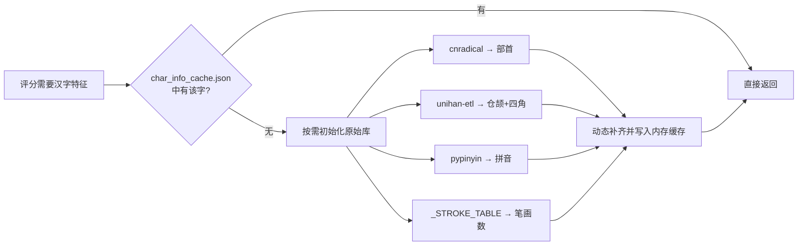

# 屏幕采集与 OCR 识别规范

> 长期设计规则与决策依据，覆盖 ADB 连接、模板匹配、PaddleOCR 两段式识别、轮询。

## 一、ADB 采集层

### 规则 1.1：命令注入防护——列表参数

`_run_adb(*args)` 使用 `subprocess.run([adb_path, *args])` 列表参数，而非字符串拼接。

**为什么：** 如果 ADB 路径包含空格（常见于 Windows，如 `D:\Program Files\adb.exe`），字符串拼接会因参数分割错误产生格式错误；极端情况下用户提供的 `adb_path` 如果包含 `; rm -rf /` 等字符会构成命令注入。subprocess 的列表参数将每个元素视为独立参数，不经过 shell 解析。

### 规则 1.2：设备序列号格式校验

`_check_device_serial_safe()` 验证 `IP:port` 格式，端口在 1-65535 范围。

**为什么：** ADB 的 `-s` 参数接受任意字符串作为设备标识。如果没有校验，注入的字符串可能导致非预期的 ADB 行为。校验不仅防注入也防常见的配置错误（如端口号 99999）。

### 规则 1.3：screencap 使用 exec-out 模式

`adb -s <serial> exec-out screencap -p` 替代 `adb shell screencap -p`。

**为什么：** `exec-out` 模式直接输出二进制数据到 stdout，中间不经过设备上的 shell 解析，更快且不会因 shell 编码问题损坏二进制 PNG 数据。

## 二、模板匹配

### 规则 2.1：模板匹配是前置过滤器

`TemplateManager.match(image, threshold)` 在 PaddleOCR 之前执行，仅当置信度 ≥ threshold 时才走后续 OCR 流程。

**为什么：** 模板匹配（OpenCV `matchTemplate`）耗时 < 50ms，而 PaddleOCR 每次识别需要 0.5-3 秒。如果每 2 秒就对全屏做一次 PaddleOCR，CPU 和电量的消耗都会很大。模板匹配先低成本过滤掉非武将选择页的画面，只在确认是目标页面后才执行昂贵的 OCR。

### 规则 2.2：TM_CCOEFF_NORMED 是唯一算法

使用归一化相关匹配而非平方差或其他算法。

**为什么：** 名将杀的游戏 UI 在不同版本中可能会有颜色微调（亮度/对比度），但武将选择页的布局和形状不变。相关系数匹配对光照变化不敏感——它比较的是灰度值的相对趋势而非绝对值，因此能容忍一定程度的 UI 视觉变化而不需要用户重新制作模板。

### 规则 2.3：分辨率保护

```python
if gray.shape[0] < self._template.shape[0] ...
    return False, 0.0
```

**为什么：** 当前该功能仅为模拟器适用，因此不考虑适配问题，若后续需要适配再考虑调整。

## 三、PaddleOCR 识别

### 规则 3.1：两段式识别策略

第一段：PaddleOCR 全量字典识别。
第二段：用 155 名武将名库做编辑距离矫正（不过滤置信度，始终执行）。

```
PaddleOCR → 文字 + 置信度
  │
  ├── 极高置信度（≥99.5%）且 OCR 结果不在武将库？
  │   └── ✅ 信任 OCR，保留原文（保护新增武将不被误矫）
  │
  └── 否则 → 编辑距离匹配
       └── 距离 ≤ 1 的单候选 → 采纳
       └── 距离 ≤ 1 的多候选 → 多维汉字特征评分决胜
```

**为什么（置信度门槛移除）：** 旧实现只在 `conf < 98.8%` 时触发矫正，未考虑 PaddleOCR 可能**高置信度地误识别**——如将"王翦"识别为"王异"且置信度 > 99%。改用编辑距离本身做安全阀（阈值 1），比置信度数字更可靠。同时增加极高置信度保护（≥99.5% 且不在库），避免新武将（如游戏更新添加的角色）被强行拉回旧名列表。

**为什么（保留极高置信度保护）：** 形近字误读（"曹不"→"曹丕"）置信度通常不会超过 99.5%，而正确识别新武将（如"王明"）置信度极高。这条保护让新武将可以不经矫正直接通过。

### 规则 3.2：Levenshtein 距离阈值 ≤ 1

`_EDIT_DISTANCE_THRESHOLD = 1`。允许 1 个编辑距离的差异（增/删/改一个字），超过则接受 PaddleOCR 的原始结果。

**为什么：** 武将名是 2-3 个汉字。PaddleOCR 的识别错误通常是 1 个字的偏差（"曹不"→"曹丕"）。距离为 2 的差异意味着两个完全不同的人名（如"诸葛亮"→"司马懿"= 3 个字符完全不同)，强行矫正会张冠李戴。

### 规则 3.5：多维汉字特征评分决胜（替代 Unicode 码位视觉相似度）

当编辑距离筛选出多个候选（如 OCR 输出"王剪"，同时匹配到"王翦"和"王异"）时，用以下加权评分选择最可能的目标：

| 维度 | 权重 | 数据来源 | 评分方式 |
|------|------|---------|----------|
| 四角号码 | 40% | unihan-etl（UNIHAN `kFourCornerCode`） | 5 位码逐位相同数 / 5 |
| 仓颉码 | 40% | unihan-etl（UNIHAN `kCangjie`） | `difflib.SequenceMatcher` 序列匹配比 |
| 部首 | 20% | cnradical | 相同为 1，不同为 0 |

评分逐字对比：**相同字符直接加满分 1.0**，不同字符才用以上加权公式。这样的优势是在"精确匹配文本 vs 邻近替代"的场景中，精确匹配者因相同字符多而自然领先，不需要额外的置信度回退逻辑。

**平局处理**：主评分打平时（差值 < 1e-9），追加两个维度依次排序：
1. 拼音相似度（pypinyin，同音为 1 否则为 0）→ 降序
2. 笔画数差（内联字典 `_STROKE_TABLE`）→ 升序

**为什么用四角号码 + 仓颉码 + 部首代替 Unicode 码位差：**
旧算法用 `1 - |cp1 - cp2| / 500` 评估字形相似度，假设"Unicode 码位相近的汉字字形相似"。但这个假设不成立——"剪"(U+526A)和"翦"(U+7FE6)码位差 7353，被判定为完全不相似；而"翦"(U+7FE6)和"翡"(U+7FE1)仅差 5，被判定为高度相似（0.99）。实际上"翦"和"剪"字形几乎相同，"翦"和"翡"仅共用一个"羽"部件。三个结构化维度（四角号码反映汉字四角结构、仓颉码反映字形编码层次、部首直接定位字的大类）各自反映了汉字的不同视觉特征，加权后对形近字的区分度远优于单维度的码位差。

**为什么权重是 40-40-20：**
四角号码和仓颉码都有较高的区分度（5 位码和变长序列），各自承担主要的区分任务，各占 40%。部首是二值变量（相同/不同），区分度较低但能直接约束字的大类，占 20% 足以在部首不同时拉开差距。

**为什么保留平局决胜维度（拼音/笔画数）：**
理论上 40-40-20 的三个维度几乎不会打出完全相同的总分——不同的汉字极少同时拥有完全相同的四角号码、仓颉码和部首。保留平局处理是为极端罕见情况做防御性兜底，确保算法在任何情况下都有确定性的输出。拼音和笔画数选择是因为：同音字互相混淆的概率高（"赢"→"嬴"），拼音匹配可以直接否定这类错误；笔画数辅助做最终区分。

### 规则 3.6：汉字特征缓存 warmup + 运行时动态补齐

汉字特征数据（四角号码、仓颉码、部首、拼音、笔画数）按以下层次获取：



| 层 | 速度 | 覆盖范围 |
|----|------|---------|
| `char_info_cache.json`（`src/data/`） | ~10ms | 223 个高频汉字（武将名 + 常见 OCR 误识字） |
| 运行时原始库（按需） | 部首 22ms + 拼音 194ms + unihan 490ms | 任意汉字（理论兜底） |
| `_STROKE_TABLE` 内联字典 | ~0ms | 约 1100 个常用汉字 |

**为什么不做成纯 JSON 或纯动态：**
纯 JSON 需要手动维护（新武将加入时如果用了缓存未收录的汉字，评分退化为 0），纯动态则每次启动都要加载 unihan CSV（~500ms）。混合策略：JSON 覆盖 99% 的日常场景（启动仅 ~10ms），遇到缓存缺失的汉字时按需补齐一次并写入进程内存，后续不再重复查询。内联笔画字典零依赖、零加载时间。

**为什么 warmup 时预加载 pypinyin：**
pypinyin 首次加载约 194ms，虽然正常情况下缓存全覆盖不会触发它，但预加载到 warmup 中可以把这 194ms 从"动态补齐的首次体验"转移到应用启动阶段，与 PaddleOCR 的 3.5 秒加载并行，用户感知不到。

### 规则 3.3：图像预处理四步流程固定

`放大 3× → CLAHE → 锐化 → 灰度`，顺序不可调换。

**为什么：** 原始 ROI 只有 40×140px，直接送 PaddleOCR 对小字符识别率低。先放大使字符像素更密集；再 CLAHE 增强局部对比度解决游戏 UI 的渐变背景干扰；锐化强化边缘提高字符清晰度；最后灰度化是 PaddleOCR 的更优输入格式。调换顺序（如先灰度再放大）会导致信息丢失。

### 规则 3.4：PaddleOCR 延迟加载 + 预热

```python
@property
def _engine(self):
    if self._ocr is None:
        self._ocr = PaddleOCR(...)
    return self._ocr
```

`main.py` 中在应用启动时调用一次 `warmup()`。

**为什么：** PaddleOCR 首次加载模型需要 2-3 秒。如果等到用户点击"截图"才加载，用户会看到 2-3 秒的界面冻结。预热将加载提前到应用启动阶段，只是把"卡顿"转移到了启动时——但启动时用户预期需要等待，而操作时不需要。

## 四、持续轮询

### 规则 4.1：轮询逻辑独立于 OCR 启用开关

```python
should_ocr = config.get("mumu_ocr_enabled", False) or is_poll
```

**为什么：** 轮询模式有自己的独立决策链（模板匹配 → OCR），不应受"手动截图自动识别"开关的影响。用户可能关掉手动识别的 OCR（因为截图按钮只是取画面），但希望轮询模式在检测到武将页面时自动识别。

### 规则 4.2：冷却期内完全跳过

`_poll_cooldown_until` 检查放在 `_on_poll_capture()` 最顶部，冷却期内不截图、不匹配、不 OCR。

**为什么：** 武将选择页出现后用户通常会花 10-30 秒选将，3 分钟内没必要重复识别。冷却不仅跳过 OCR，也跳过截图和模板匹配，因为已知会匹配成功（画面没变）。这是最轻量的处理方式——什么都不做。

### 规则 4.3：轮询定位在 MainWindow 而非 CaptureService

轮询逻辑在 `MainWindow._on_poll_capture()` 中实现，而非 `CaptureService` 内部。

**为什么：** 轮询涉及三个模块的协调：CaptureService（截图）、TemplateManager（匹配）、GeneralRecognizer（OCR）+ 最终更新 RecommendationPanel（UI）。放在 MainWindow 作为编排器是合理的——它与所有模块都有连接关系，且最终结果直接更新 UI。
