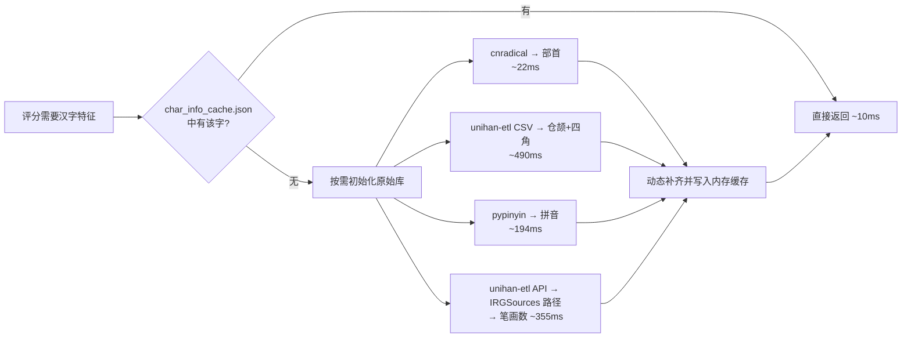

# 屏幕采集与 OCR 识别规范

> 长期设计规则与决策依据，覆盖 ADB 连接、模板匹配、PaddleOCR 两段式识别、轮询。

## 一、ADB 采集层

### 规则 1.1：命令注入防护——列表参数

`_run_adb(*args)` 使用 `subprocess.run([adb_path, *args])` 列表参数，而非字符串拼接。

**为什么：** 如果 ADB 路径包含空格（常见于 Windows，如 `D:\Program Files\adb.exe`），字符串拼接会因参数分割错误产生格式错误；极端情况下用户提供的 `adb_path` 如果包含 `; rm -rf /` 等字符会构成命令注入。subprocess 的列表参数将每个元素视为独立参数，不经过 shell 解析。

### 规则 1.2：设备序列号格式校验

`_check_device_serial_safe()` 验证 `IP:port` 格式，端口在 1-65535 范围。

**为什么：** ADB 的 `-s` 参数接受任意字符串作为设备标识。如果没有校验，注入的字符串可能导致非预期的 ADB 行为。校验不仅防注入也防常见的配置错误（如端口号 99999）。

### 规则 1.3：screencap 使用 exec-out 模式

`adb -s <serial> exec-out screencap -p` 替代 `adb shell screencap -p`。

**为什么：** `exec-out` 模式直接输出二进制数据到 stdout，中间不经过设备上的 shell 解析，更快且不会因 shell 编码问题损坏二进制 PNG 数据。

### 规则 1.4：截图输出必须完整后才能交给 OCR

`screencap_full()` 对 stdout 为空或 PIL 解码失败的结果最多短暂重试 3 次，并调用 `Image.load()` 验证图像数据已完整加载。重试仅覆盖截图数据瞬态异常；`device offline` 等明确的设备连接错误仍立即使会话失效。

**为什么：** 模拟器渲染和 ADB transport 短暂繁忙时，命令可能返回空或截断的 PNG。直接把一次失败交给轮询会产生间歇性错误日志，直接接受截断数据则可能把不完整画面送入模板匹配/OCR。

## 二、模板匹配

### 规则 2.1：模板匹配是前置过滤器

`TemplateManager.match(image, threshold)` 在 PaddleOCR 之前执行，仅当置信度 ≥ threshold 时才走后续 OCR 流程。

**为什么：** 模板匹配（OpenCV `matchTemplate`）耗时 < 50ms，而 PaddleOCR 每次识别需要 0.5-3 秒。如果每 2 秒就对全屏做一次 PaddleOCR，CPU 和电量的消耗都会很大。模板匹配先低成本过滤掉非武将选择页的画面，只在确认是目标页面后才执行昂贵的 OCR。

### 规则 2.2：TM_CCOEFF_NORMED 是唯一算法

使用归一化相关匹配而非平方差或其他算法。

**为什么：** 名将杀的游戏 UI 在不同版本中可能会有颜色微调（亮度/对比度），但武将选择页的布局和形状不变。相关系数匹配对光照变化不敏感——它比较的是灰度值的相对趋势而非绝对值，因此能容忍一定程度的 UI 视觉变化而不需要用户重新制作模板。

### 规则 2.3：分辨率保护

```python
if gray.shape[0] < self._template.shape[0] ...
    return False, 0.0
```

**为什么：** 当前该功能仅为模拟器适用，因此不考虑适配问题，若后续需要适配再考虑调整。

## 三、PaddleOCR 识别

### 规则 3.1：两段式识别策略

第一段：PaddleOCR 全量字典识别。
第二段：用 165 名武将名库做编辑距离矫正（不过滤置信度，始终执行）。

```
PaddleOCR → 文字 + 置信度
  │
  └── 编辑距离匹配
       └── 距离 ≤ 1 的单候选 → 采纳
       └── 距离 ≤ 1 的多候选 → 多维汉字特征评分决胜
       └── 无候选 → 保留 OCR 原文；极高置信度（≥99.5%）作为新武将保护标记
```

**为什么（置信度门槛移除）：** 旧实现只在 `conf < 98.8%` 时触发矫正，未考虑 PaddleOCR 可能**高置信度地误识别**——如将"王翦"识别为"王异"且置信度 > 99%。改用编辑距离本身做安全阀（阈值 1），比置信度数字更可靠。先查找词表候选，再在无候选时保留极高置信度结果，避免新武将（如游戏更新添加的角色）被强行拉回旧名列表。

**为什么（保留极高置信度保护）：** 形近字误读也可能达到极高置信度（如"赢政"→"嬴政"）。因此，只要编辑距离筛选到词表候选，仍执行纠错；只有无候选的高置信度结果才作为新武将原文保留。

`_EDIT_DISTANCE_THRESHOLD = 1`。允许 1 个编辑距离的差异（增/删/改一个字），超过则接受 PaddleOCR 的原始结果。

**为什么：** 武将名是 2-3 个汉字。PaddleOCR 的识别错误通常是 1 个字的偏差（"曹不"→"曹丕"）。距离为 2 的差异意味着两个完全不同的人名（如"诸葛亮"→"司马懿"= 3 个字符完全不同)，强行矫正会张冠李戴。

### 规则 3.2：OCR ROI 使用独立的可校验配置

`config/ocr_rois.default.json` 是随版本发布的默认布局；`config/ocr_rois.json` 是用户本地覆盖，按页面整体覆盖默认布局。选将推荐必须配置 8 个名称 ROI；对局攻略必须配置 5 组名称和阵营 ROI。每个布局都保存自己的 `reference_size`，不得复用页面模板的参考尺寸。

配置页的“截图编辑”和“图片编辑”会将当前截图尺寸写入 `reference_size`；保存后的新布局只影响之后提交的 OCR 任务，已入队任务继续使用其提交时的不可变布局快照。加载时会校验坐标、尺寸、边界和槽位数量；本地覆盖无效时回退默认布局并记录警告。

**为什么：** 官方 UI 更新可能只移动文字位置，而页面模板制作分辨率可以与 OCR 的参考分辨率不同。将二者绑定会导致缩放后裁剪偏移；将 ROI 保存在本地覆盖文件则可让用户快速调整，同时不因版本更新丢失自己的坐标。

### 规则 3.3：图像预处理四步流程固定

`放大 3× → CLAHE → 锐化 → 灰度`，顺序不可调换。

**为什么：** 2560×1440 基准下默认武将名称 ROI 为 50×145px，其中高度从 140px 增加到 145px，为竖排名称保留上下缓冲，降低字符被截断的概率。先放大使字符像素更密集；再 CLAHE 增强局部对比度解决游戏 UI 的渐变背景干扰；锐化强化边缘提高字符清晰度；最后灰度化是 PaddleOCR 的更优输入格式。调换顺序（如先灰度再放大）会导致信息丢失。

每个槽位的 OCR 诊断日志必须包含槽位编号、缩放后的 ROI 坐标、原始文本和置信度，便于区分 ROI 截断与 OCR 误识别。

### 规则 3.4：PaddleOCR 延迟加载 + 预热

```python
@property
def _engine(self):
    if self._ocr is None:
        self._ocr = PaddleOCR(...)
    return self._ocr
```

`main.py` 中在 `QApplication` 初始化后立即调用 `warmup()`，早于 `MainWindow()` 构建。

**为什么：** PaddleOCR 首次加载模型需要 2-3 秒。如果等到用户点击"截图"才加载，用户会看到 2-3 秒的界面冻结。将预热放在 `MainWindow()` 之前有两个好处：
1. 启动时的 2-3 秒加载发生在用户看到窗口之前，用户在等待窗口出现的过程中不会尝试交互。
2. 如果等到窗口出现后再用 `QTimer.singleShot(0)` 预热，用户看到窗口后以为程序已就绪，点击任何按钮都会触发 2-3 秒的无响应，体验更糟——**窗口可见 = 用户认为可操作**是本能预期。

`DataFacade` 双次加载 ~10-20ms 的成本可以忽略，在 2026 年的硬件上用户完全无感知。为了让 PaddleOCR 的 2-3 秒加载提前到"窗口出现前"，这个微小的冗余是可接受的。

### 规则 3.5：多维汉字特征评分决胜（替代 Unicode 码位视觉相似度）

当编辑距离筛选出多个候选（如 OCR 输出"王剪"，同时匹配到"王翦"和"王异"）时，用以下加权评分选择最可能的目标：

| 维度 | 权重 | 数据来源 | 评分方式 |
|------|------|---------|----------|
| 四角号码 | 40% | unihan-etl（UNIHAN `kFourCornerCode`） | 5 位码逐位相同数 / 5 |
| 仓颉码 | 40% | unihan-etl（UNIHAN `kCangjie`） | `difflib.SequenceMatcher` 序列匹配比 |
| 部首 | 20% | cnradical | 相同为 1，不同为 0 |

评分逐字对比：**相同字符直接加满分 1.0**，不同字符才用以上加权公式。这样的优势是在"精确匹配文本 vs 邻近替代"的场景中，精确匹配者因相同字符多而自然领先，不需要额外的置信度回退逻辑。

**平局处理**：主评分打平时（差值 < 1e-9），追加两个维度依次排序：
1. 拼音相似度（pypinyin，同音为 1 否则为 0）→ 降序
2. 笔画数差（UNIHAN `kTotalStrokes`，从 `Unihan_IRGSources.txt` 懒加载，路径通过 `unihan_etl.Options().work_dir` 获取）→ 升序

**为什么用四角号码 + 仓颉码 + 部首代替 Unicode 码位差：**
旧算法用 `1 - |cp1 - cp2| / 500` 评估字形相似度，假设"Unicode 码位相近的汉字字形相似"。但这个假设不成立——"剪"(U+526A)和"翦"(U+7FE6)码位差 7353，被判定为完全不相似；而"翦"(U+7FE6)和"翡"(U+7FE1)仅差 5，被判定为高度相似（0.99）。实际上"翦"和"剪"字形几乎相同，"翦"和"翡"仅共用一个"羽"部件。三个结构化维度（四角号码反映汉字四角结构、仓颉码反映字形编码层次、部首直接定位字的大类）各自反映了汉字的不同视觉特征，加权后对形近字的区分度远优于单维度的码位差。

**为什么权重是 40-40-20：**
四角号码和仓颉码都有较高的区分度（5 位码和变长序列），各自承担主要的区分任务，各占 40%。部首是二值变量（相同/不同），区分度较低但能直接约束字的大类，占 20% 足以在部首不同时拉开差距。

**为什么保留平局决胜维度（拼音/笔画数）：**
理论上 40-40-20 的三个维度几乎不会打出完全相同的总分——不同的汉字极少同时拥有完全相同的四角号码、仓颉码和部首。保留平局处理是为极端罕见情况做防御性兜底，确保算法在任何情况下都有确定性的输出。拼音和笔画数选择是因为：同音字互相混淆的概率高（"赢"→"嬴"），拼音匹配可以直接否定这类错误；笔画数辅助做最终区分。

### 规则 3.6：汉字特征缓存 warmup + 运行时动态补齐

汉字特征数据（四角号码、仓颉码、部首、拼音、笔画数）按以下层次获取：



| 层 | 速度 | 覆盖范围 |
|----|------|---------|
| `char_info_cache.json`（`src/data/`） | ~10ms | 223 个高频汉字（武将名 + 常见 OCR 误识字） |
| 运行时原始库（按需） | 合集 ~1060ms，均单次 | 任意汉字（理论兜底） |

**为什么不做成纯 JSON 或纯动态：**
纯 JSON 需要手动维护（新武将加入时如果用了缓存未收录的汉字，评分退化为 0），纯动态则每次启动都要加载 unihan CSV（~500ms）。混合策略：JSON 覆盖 99% 的日常场景（启动仅 ~10ms），遇到缓存缺失的汉字时按需补齐一次并写入进程内存，后续不再重复查询。

**为什么 warmup 时预加载 pypinyin：**
pypinyin 首次加载约 194ms，虽然正常情况下缓存全覆盖不会触发它，但预加载到 warmup 中可以把这 194ms 从"动态补齐的首次体验"转移到应用启动阶段，与 PaddleOCR 的 3.5 秒加载并行，用户感知不到。

#### 3.6.1：四种数据源的分工与选择依据

五个维度的数据来自四个不同的底层源，各有不同的覆盖率和获取方式。

| 维度 | 底层源 | 获取方式 | 覆盖率 |
|------|--------|---------|--------|
| 四角号码 | UNIHAN `kFourCornerCode` | `unihan_etl.Packager` 导出 CSV | 16,916/29,381 (57.57%) |
| 仓颉码 | UNIHAN `kCangjie` | `unihan_etl.Packager` 导出 CSV | 29,189/29,381 (99.35%) |
| 部首 | cnradical（CC-CEDICT 部首数据） | Python 运行时 API | ~12,000 字 |
| 拼音 | pypinyin（基于《新华字典》拼音表） | Python 运行时 API | ~18,000 字 |
| 笔画数 | UNIHAN `kTotalStrokes` | 直接解析 `Unihan_IRGSources.txt`（通过 `unihan_etl` API 获取路径） | **102,998 条** |

**为什么笔画数不通过 `unihan_etl` CSV 管道统一获取，而是单开一条路：**

`unihan_etl` 的 `Packager(src.fields=["kTotalStrokes"])` 会在 CSV 中正确地创建该列，但 `unihan_etl` 0.43.0（以及当前所有已知版本）**不会向该列填充数据**——导出后的 CSV 中 `kTotalStrokes` 列 100% 为空，尽管原始 `Unihan_IRGSources.txt` 中有 102,998 条完整的笔画数记录。

这是 `unihan_etl` 自身的限制：它只从 `Unihan_DictionaryLikeData.txt`、`Unihan_Readings.txt` 等子文件中提取数据，但 `kTotalStrokes` 位于 `Unihan_IRGSources.txt` 中，后者不在 `Packager` 的 CSV 输入文件列表里。

**既然 CSV 不支持，为什么不退回到旧实现的硬编码路径：**

旧代码直接写死 `~/AppData/Local/Tony Narlock/unihan_etl/Cache/downloads/Unihan_IRGSources.txt`，存在三个问题：

1. **硬编码 Windows 风格路径**，在 Linux/macOS 上直接无效。
2. **依赖 `unihan_etl` 的内部缓存目录结构**（`Cache/downloads/`），该目录是 `unihan_etl` 的实现细节，不是其公开 API，在版本升级中可能变化。旧提交 `a65a24b`（用 UNIHAN `kTotalStrokes` 懒加载替换内联字典）引入该路径后，实际上引入了一个隐式的跨平台兼容性债务。
3. **无法降级**：路径不存在时静默失败返回空字典，但排查者无法区分"文件不存在"和"文件确实没有该字段"。

**当前实现：由 `CharacterFeatureRepository` 通过 `unihan_etl` 公开 API 获取路径。**

```python
from unihan_etl.core import Options
irg_path = Options().work_dir / "Unihan_IRGSources.txt"
```

`Options().work_dir` 是 `unihan_etl` 公开的属性，返回 `Unihan.zip` 解压后的缓存目录，无需假设 `unihan_etl` 的内部目录结构。仓库通过 `Options().destination` 获取导出的 `unihan.csv`，通过 `work_dir` 获取原始笔画文件；代码中不再出现 Windows/AppData 专属路径，缓存 JSON 路径可在构造 `CharacterFeatureRepository` 时注入。

**为什么不把 `kTotalStrokes` 写入 `char_info_cache.json` 来完全绕过文件解析：**

`char_info_cache.json` 目前只收录了 223 个高频汉字（覆盖了所有武将名用字），如果在这里固化笔画数，确实可以消除对 `Unihan_IRGSources.txt` 的运行时依赖。但这样做的风险是：当武将名出现缓存未收录的汉字时，`CharacterFeatureRepository` 需要动态补齐四角号码、仓颉码、部首、拼音和笔画数；若不保留笔画懒加载，平局判定会退化。保留仓库内的笔画懒加载机制，使得任何汉字在运行时都能实时补齐笔画数，与其余特征的补齐能力对等。

**为什么不在运行时用 `Options(download=True)` 自动下载 IRGSources 文件：**

我们使用 `download=False`（也是旧代码的行为）。理由有两层：

1. **笔画数是平局决胜的最后一环**，不是主评分维度。主评分（四角 40% + 仓颉 40% + 部首 20%）通常就能区分候选。笔画数只有在前三者打出精确平局时才参与——这在理论上是极端罕见的情况。为一个近乎不会触发的场景触发网络请求不合理。

2. **`unihan_etl` 在 pip install 阶段已经自动下载并缓存了 `Unihan.zip`**，解压后的 `Unihan_IRGSources.txt` 存在于缓存目录中。如果用户无故删除了缓存，笔画数降级为 0，平局退化为仅靠拼音区分——这仍然产生确定性输出，只是区分度略有降低。**不做网络请求，不静默降级，保持确定性。**

#### 3.6.2：四角号码的覆盖率缺口与兜底

四角号码覆盖率约 57.57%，低于仓颉码的 99.35%。这意味着约 42% 的汉字（主要是扩展区生僻字）在四角号码维度上得 0 分，加权后拉低总分。

但这在武将名场景中不构成问题：

- **武将名用字的四角号码覆盖率是 99.6%（234/235）**，因为武将名全属常用汉字，均在 UNIHAN 基础区（U+4E00–U+9FFF），该区域的四角号码覆盖率已超过 99%。
- 缺口主要在 U+3400–U+4DBF（CJK 扩展 A 区）及更后的区域，这些区域的汉字在游戏武将名中几乎不会出现。

如果未来有武将名用到了扩展区汉字且恰好四角号码缺失，动态补齐时 `_query_char_from_unihan()` 返回 `{}`，该字符的四角积分退化为 0。此时剩余的仓颉 40% + 部首 20% = 60% 权重仍然能做出有效区分——不是全量退化。

## 四、持续轮询

### 规则 4.1：轮询逻辑独立于 OCR 启用开关

```python
should_ocr = config.get("mumu_ocr_enabled", False) or is_poll
```

**为什么：** 轮询模式有自己的独立决策链（模板匹配 → OCR），不应受"手动截图自动识别"开关的影响。用户可能关掉手动识别的 OCR（因为截图按钮只是取画面），但希望轮询模式在检测到武将页面时自动识别。

### 规则 4.2：冷却期内完全跳过

`_poll_cooldown_until` 检查放在 `_on_poll_capture()` 最顶部，冷却期内不截图、不匹配、不 OCR。

**为什么：** 武将选择页出现后用户通常会花 10-30 秒选将，3 分钟内没必要重复识别。冷却不仅跳过 OCR，也跳过截图和模板匹配，因为已知会匹配成功（画面没变）。这是最轻量的处理方式——什么都不做。

### 规则 4.3：轮询定位在 PollCoordinator 而非 CaptureService

轮询逻辑在 `PollCoordinator._on_poll_tick()` 中实现，而非 `CaptureService` 或 `MainWindow` 内部。

**为什么：** 轮询涉及 CaptureService（截图）、TemplateManager（匹配）、GeneralRecognizer（OCR）和 OcrService（会话与退避）的协调。独立协调器负责后台工作、过期结果过滤和状态提交；MainWindow 只接收结果并更新 RecommendationPanel 等界面。

## 五、官方榜单图片导入需求

### 5.1 目标与处理链

官方榜单导入是独立于模拟器 OCR 的本地图片流程。目标是输出完整行序的榜单 CSV 与可人工修正的异常清单；不能因一行名称漏识别而让后续排名整体错位。

```text
原图 → 检测表格区域、横线与列边界 → 按视觉行序切分单元格
     → 单元格 OCR / 名称词表校正 / 胜率数字识别 → 校验 → 原子导出
```

- 行数只由横线和恢复后的行边界决定，不由 OCR 成功数量、160 人上限或 OCR 排名决定。
- 正式排名由视觉顺序从 1 连续生成；OCR 排名仅用于校验。
- 名称格至少尝试原图放大与增强图；完整词表命中优先于单字高置信结果。
- 单字歧义时才进行逐字补识别和按需繁体模型兜底；未知名称不可强行改为旧武将，保留原文并待复核。

### 5.2 输出、异常与验收

| 输入表 | 正式输出 | 必含列 |
|---|---|---|
| 2v2 胜率 | `2v2胜率排行.csv` | 排名、武将、胜率 |
| 2v2 出场 | `2v2出场排行.csv` | 排名、武将 |
| 武将放逐 | `武将放逐.csv` | 排名、武将 |

每份正式文件对应待复核 CSV；复核项至少含期望排名、OCR 原文、置信度、异常原因、原图坐标、行截图路径。名称为空、低置信、异常字符、重复/异常长名称、OCR 排名与行序不一致均必须进入待复核，但仍保留正式 CSV 的期望排名。测试必须覆盖漏横线补插、漏识别保序、单字歧义、未知新角色、两表独立覆盖和导入失败不破坏旧正式文件。
