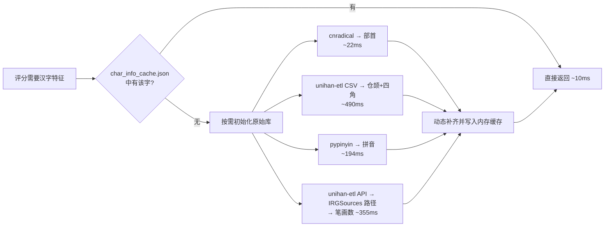

# 屏幕采集与 OCR 识别规范

> 长期设计规则与决策依据，覆盖 ADB 连接、模板匹配、PaddleOCR 两段式识别、轮询。

## 一、ADB 采集层

### 规则 1.1：命令注入防护——列表参数

`_run_adb(*args)` 使用 `subprocess.run([adb_path, *args])` 列表参数，而非字符串拼接。

**为什么：** 如果 ADB 路径包含空格（常见于 Windows，如 `D:\Program Files\adb.exe`），字符串拼接会因参数分割错误产生格式错误；极端情况下用户提供的 `adb_path` 如果包含 `; rm -rf /` 等字符会构成命令注入。subprocess 的列表参数将每个元素视为独立参数，不经过 shell 解析。

### 规则 1.2：设备序列号格式校验

`_check_device_serial_safe()` 验证 `IP:port` 格式，端口在 1-65535 范围。

**为什么：** ADB 的 `-s` 参数接受任意字符串作为设备标识。如果没有校验，注入的字符串可能导致非预期的 ADB 行为。校验不仅防注入也防常见的配置错误（如端口号 99999）。

### 规则 1.3：screencap 使用 exec-out 模式

`adb -s <serial> exec-out screencap -p` 替代 `adb shell screencap -p`。

**为什么：** `exec-out` 模式直接输出二进制数据到 stdout，中间不经过设备上的 shell 解析，更快且不会因 shell 编码问题损坏二进制 PNG 数据。

### 规则 1.4：截图输出必须完整后才能交给 OCR

`screencap_full()` 对 stdout 为空或 PIL 解码失败的结果最多短暂重试 3 次，并调用 `Image.load()` 验证图像数据已完整加载。重试仅覆盖截图数据瞬态异常；`device offline` 等明确的设备连接错误仍立即使会话失效。

**为什么：** 模拟器渲染和 ADB transport 短暂繁忙时，命令可能返回空或截断的 PNG。直接把一次失败交给轮询会产生间歇性错误日志，直接接受截断数据则可能把不完整画面送入模板匹配/OCR。

## 二、模板匹配

### 规则 2.1：模板匹配是前置过滤器

`TemplateManager.match(image, threshold)` 在 PaddleOCR 之前执行，仅当置信度 ≥ threshold 时才走后续 OCR 流程。

**为什么：** 模板匹配（OpenCV `matchTemplate`）耗时 < 50ms，而 PaddleOCR 每次识别需要 0.5-3 秒。如果每 2 秒就对全屏做一次 PaddleOCR，CPU 和电量的消耗都会很大。模板匹配先低成本过滤掉非武将选择页的画面，只在确认是目标页面后才执行昂贵的 OCR。

### 规则 2.2：TM_CCOEFF_NORMED 是唯一算法

使用归一化相关匹配而非平方差或其他算法。

**为什么：** 名将杀的游戏 UI 在不同版本中可能会有颜色微调（亮度/对比度），但武将选择页的布局和形状不变。相关系数匹配对光照变化不敏感——它比较的是灰度值的相对趋势而非绝对值，因此能容忍一定程度的 UI 视觉变化而不需要用户重新制作模板。

### 规则 2.3：分辨率保护

```python
if gray.shape[0] < self._template.shape[0] ...
    return False, 0.0
```

**为什么：** 当前该功能仅为模拟器适用，因此不考虑适配问题，若后续需要适配再考虑调整。

## 三、PaddleOCR 识别

### 规则 3.1：字数门禁、候选白名单、候选内评分

常规截图名称识别按以下顺序决策，武将推荐和对局攻略共用该规则：

```
PaddleOCR 多路证据 → OCR 文字 + 置信度
  │
  ├── 精确命中词表 → exact
  ├── OCR 原文是候选严格前缀 → missing
  │    └── 只保留前缀候选；唯一前缀至少识别出 2 字才可确认
  ├── OCR 原文与候选等长、编辑距离 ≤ 1 → complete
  │    ├── 唯一错字候选字形分 ≥ 0.55 → unique_similarity
  │    └── 多候选满足绝对分、领先分和双证据门槛 → multi_similarity
  ├── 同时命中严格前缀与等长候选 → uncertain，合并两类候选
  └── 其他增删字候选 → uncertain，保持未确认
```

`_EDIT_DISTANCE_THRESHOLD = 1` 只负责建立候选集合，不代表候选可以直接采纳。缺字前缀不参与字形评分；单字前缀即使只有一个词表候选也保持待确认，避免把信息量不足的结果自动补全。其他增删字结果也只保留为待确认候选。

多路 OCR 的所有非空候选集合必须取交集。交集为空时状态为 `conflict`；精确命中或已通过评分的结果若不属于任一路非空候选集合，同样回退为 `conflict`。任何证据都不得将名称改到候选白名单之外，因此“卫”产生的 `[卫青, 卫玠]` 不能被另一条“正瑜/周瑜”证据跨集合覆盖。

这里的字数门禁比较 OCR 原文与词表候选的字符数，不声称已经从图片中可靠测得实际字符数。名称 ROI 会混入卡框和底部定位字，边缘槽位的像素行分割也不稳定，当前不把视觉字符分割作为硬门禁。

### 规则 3.2：OCR ROI 使用独立的可校验配置

`config/ocr_rois.default.json` 是随版本发布的默认布局；`config/ocr_rois.json` 是用户本地覆盖，按页面整体覆盖默认布局。选将推荐必须配置 8 个名称 ROI；对局攻略必须配置 5 组名称和阵营 ROI。每个布局都保存自己的 `reference_size`，不得复用页面模板的参考尺寸。

配置页的“截图编辑”和“图片编辑”会将当前截图尺寸写入 `reference_size`；保存后的新布局只影响之后提交的 OCR 任务，已入队任务继续使用其提交时的不可变布局快照。加载时会校验坐标、尺寸、边界和槽位数量；本地覆盖无效时回退默认布局并记录警告。

**为什么：** 官方 UI 更新可能只移动文字位置，而页面模板制作分辨率可以与 OCR 的参考分辨率不同。将二者绑定会导致缩放后裁剪偏移；将 ROI 保存在本地覆盖文件则可让用户快速调整，同时不因版本更新丢失自己的坐标。

### 规则 3.3：图像预处理四步流程固定

`放大 3× → CLAHE → 锐化 → 灰度`，顺序不可调换。

**为什么：** 2560×1440 基准下默认武将名称 ROI 为 50×145px，其中高度从 140px 增加到 145px，为竖排名称保留上下缓冲，降低字符被截断的概率。先放大使字符像素更密集；再 CLAHE 增强局部对比度解决游戏 UI 的渐变背景干扰；锐化强化边缘提高字符清晰度；最后灰度化是 PaddleOCR 的更优输入格式。调换顺序（如先灰度再放大）会导致信息丢失。

每个槽位的 OCR 诊断日志必须包含槽位编号、缩放后的 ROI 坐标、原始文本和置信度，便于区分 ROI 截断与 OCR 误识别。

### 规则 3.4：PaddleOCR 延迟加载 + 预热

```python
@property
def _engine(self):
    if self._ocr is None:
        self._ocr = PaddleOCR(...)
    return self._ocr
```

`main.py` 在启动页显示期间创建 `MainWindow`，随后在窗口显示前调用 `start_ocr_warmup()`。预热任务始终进入该窗口所属的唯一 `OcrWorker`，不依赖 ADB 连接状态；`CaptureService` 以 `idle → warming → ready/failed` 状态和 `ocr_warmup_state_changed` 信号反馈结果，失败后可重新提交。

**为什么：** PaddleOCR 首次构造、OpenCV 首次预处理以及检测/识别预测器首次执行均有冷启动成本。预热会在同一 worker 中依次加载模型、预加载词表字符特征、执行代表性名称拼图的检测与直接识别推理。这样本地图片导入与模拟器截图共用已预热实例，且不在 GUI 线程阻塞窗口显示。用户在预热完成前提交的任务按队列顺序等待预热完成，不会创建第二个模型实例。Windows 下 PaddleOCR 首次导入会执行系统与 CUDA 探测短命令，统一加载入口仅在导入和构造期间为这些子进程设置 `CREATE_NO_WINDOW`，随后恢复 `Popen`，避免无控制台启动时出现短命令窗口闪烁。ADB 截图的 PNG 保存由独立单线程执行器处理，OCR 完成不等待保存；`image_saved` 是保存完成边界，未完成时 `capture_completed.save_path` 为 `None`。

### 规则 3.4.1：同类 ROI 拼图批处理与逐槽回退

选将页的名称 ROI 组成一张横向拼图；对局攻略的名称 ROI 和阵营 ROI 分别组成拼图。每个槽位之间保留 30px 黑色隔离区，PaddleOCR 检测框按中心横坐标映射回原槽位。

**为什么：** 正常路径将多次检测压缩为每类 ROI 一次，同时不混合尺寸或方向不同的内容。一个槽位没有检测结果、有多个检测结果、置信度低于 0.5，或检测框无法映射时，只对此槽位执行原逐一识别，避免批处理布局变化静默降低识别准确率。批量映射成功后，名称为空、状态为 `unresolved/unknown/conflict`，或批量名称置信度低于 0.8 时，还会补充 `single_enhanced` 与 `single_plain` 两路证据；0.5 是批量检测可用门槛，0.8 是名称复核门槛，二者用途不同。

### 规则 3.5：完整等长名称的候选内字形评分

只有 OCR 原文与候选等长且恰好一个字符不同时，才对该不同字符计算加权相似度。缺字前缀和其他增删字结果不进入评分：

| 维度 | 权重 | 数据来源 | 评分方式 |
|------|------|---------|----------|
| 四角号码 | 40% | unihan-etl（UNIHAN `kFourCornerCode`） | 前四个有效数字同位置匹配数 / 4 |
| 仓颉码 | 40% | unihan-etl（UNIHAN `kCangjie`） | `1 - Levenshtein / 较长码长度` |
| 部首与笔画 | 20% | cnradical + UNIHAN `kTotalStrokes` | 同部首时取较少笔画数 / 较多笔画数，否则为 0 |

```python
if len(text) == len(candidate) and mismatch_count == 1:
    score = four_corner * 0.4 + cangjie * 0.4 + radical * 0.2
else:
    score = None
```

唯一候选自动确认要求 `score >= 0.55`。多候选自动确认必须同时满足：

- 参与投票的 OCR 证据置信度 `>= 0.7`；
- 第一名 `score >= 0.35`；
- 第一名与第二名分差 `>= 0.15`；
- 至少两个独立证据族支持同一第一名。

`batch_enhanced` 与 `single_enhanced` 同属 `enhanced` 证据族，`single_plain` 属于 `plain` 证据族；同一增强图链路不能重复计票。任一门槛不足即保持 `unresolved`，不按字典顺序、拼音或笔画强制决胜。

**为什么用四角号码 + 仓颉码 + 部首代替 Unicode 码位差：**
旧算法用 `1 - |cp1 - cp2| / 500` 评估字形相似度，假设"Unicode 码位相近的汉字字形相似"。但这个假设不成立——"剪"(U+526A)和"翦"(U+7FE6)码位差 7353，被判定为完全不相似；而"翦"(U+7FE6)和"翡"(U+7FE1)仅差 5，被判定为高度相似（0.99）。实际上"翦"和"剪"字形几乎相同，"翦"和"翡"仅共用一个"羽"部件。三个结构化维度（四角号码反映汉字四角结构、仓颉码反映字形编码层次、部首直接定位字的大类）各自反映了汉字的不同视觉特征，加权后对形近字的区分度远优于单维度的码位差。

**为什么权重是 40-40-20：**
四角号码和仓颉码都有较高的区分度（四个主角位和变长序列），各自承担主要的区分任务，各占 40%。部首信息较粗，因此只占 20%，并乘以笔画复杂度比，避免所有同部首字符固定取得满分。

某一维度的特征任一侧缺失时，该维度必须记 0 分；四角码不足四位不得补零，同部首但任一侧笔画无效时部首维度也记 0 分，不按剩余维度重新归一。

页面唯一性只处理原候选数大于 1、`length_mode` 为 `missing/complete` 的 `unresolved` 槽位。`uncertain` 以及只有一个候选但未过 0.55 安全门槛的结果，不能借页面排除自动提升。结构化结果必须携带 `length_mode` 便于审计。重复确认结果仍按证据等级回退，无法得到唯一更强证据时标记 `conflict`。

势力关联确认仅作为后续可选证据记录，本次不实现。若后续接入，势力只能过滤当前候选白名单，不能新增候选或覆盖字数门禁与冲突结果。

### 规则 3.6：汉字特征缓存 warmup + 运行时动态补齐

汉字特征数据（四角号码、仓颉码、部首、拼音、笔画数）按以下层次获取：



| 层 | 速度 | 覆盖范围 |
|----|------|---------|
| `char_info_cache.json`（`src/data/`） | ~10ms | 314 个字符（当前武将名全部字符 + 已知 OCR 误识字） |
| 运行时原始库（按需） | 合集 ~1060ms，均单次 | 任意汉字（理论兜底） |

**为什么不做成纯 JSON 或纯动态：**
静态 JSON 由 `scripts/build_character_feature_cache.py` 根据 `data/heroes.json` 和常见误识字生成，英雄数据更新后必须重新运行该脚本；运行时仍保留按需补齐，覆盖未知新字和异常 OCR 输出。

**为什么 warmup 时预加载 pypinyin：**
pypinyin 首次加载约 194ms，虽然正常情况下缓存全覆盖不会触发它，但预加载到 warmup 中可以把这 194ms 从"动态补齐的首次体验"转移到应用启动阶段，与 PaddleOCR 的 3.5 秒加载并行，用户感知不到。

**特征源失败语义：** pypinyin 预热或查询失败时记录一次 warning 并标记为不可用，后续拼音特征返回空值，避免重复异常和日志刷屏。cnradical 查询失败可能只影响单个字符，因此记录字符与异常后仅将该字符的部首留空，不全局禁用部首源。两种情况均保留其余维度继续参与纠错。

#### 3.6.1：四种数据源的分工与选择依据

五个维度的数据来自四个不同的底层源，各有不同的覆盖率和获取方式。

| 维度 | 底层源 | 获取方式 | 覆盖率 |
|------|--------|---------|--------|
| 四角号码 | UNIHAN `kFourCornerCode` | `unihan_etl.Packager` 导出 CSV | 16,916/29,381 (57.57%) |
| 仓颉码 | UNIHAN `kCangjie` | `unihan_etl.Packager` 导出 CSV | 29,189/29,381 (99.35%) |
| 部首 | cnradical（CC-CEDICT 部首数据） | Python 运行时 API | ~12,000 字 |
| 拼音 | pypinyin（基于《新华字典》拼音表） | Python 运行时 API | ~18,000 字 |
| 笔画数 | UNIHAN `kTotalStrokes` | 直接解析 `Unihan_IRGSources.txt`（通过 `unihan_etl` API 获取路径） | **102,998 条** |

**为什么笔画数不通过 `unihan_etl` CSV 管道统一获取，而是单开一条路：**

`unihan_etl` 的 `Packager(src.fields=["kTotalStrokes"])` 会在 CSV 中正确地创建该列，但 `unihan_etl` 0.43.0（以及当前所有已知版本）**不会向该列填充数据**——导出后的 CSV 中 `kTotalStrokes` 列 100% 为空，尽管原始 `Unihan_IRGSources.txt` 中有 102,998 条完整的笔画数记录。

这是 `unihan_etl` 自身的限制：它只从 `Unihan_DictionaryLikeData.txt`、`Unihan_Readings.txt` 等子文件中提取数据，但 `kTotalStrokes` 位于 `Unihan_IRGSources.txt` 中，后者不在 `Packager` 的 CSV 输入文件列表里。

**既然 CSV 不支持，为什么不退回到旧实现的硬编码路径：**

旧代码直接写死 `~/AppData/Local/Tony Narlock/unihan_etl/Cache/downloads/Unihan_IRGSources.txt`，存在三个问题：

1. **硬编码 Windows 风格路径**，在 Linux/macOS 上直接无效。
2. **依赖 `unihan_etl` 的内部缓存目录结构**（`Cache/downloads/`），该目录是 `unihan_etl` 的实现细节，不是其公开 API，在版本升级中可能变化。旧提交 `a65a24b`（用 UNIHAN `kTotalStrokes` 懒加载替换内联字典）引入该路径后，实际上引入了一个隐式的跨平台兼容性债务。
3. **无法降级**：路径不存在时静默失败返回空字典，但排查者无法区分"文件不存在"和"文件确实没有该字段"。

**当前实现：由 `CharacterFeatureRepository` 通过 `unihan_etl` 公开 API 获取路径。**

```python
from unihan_etl.core import Options
irg_path = Options().work_dir / "Unihan_IRGSources.txt"
```

`Options().work_dir` 是 `unihan_etl` 公开的属性，返回 `Unihan.zip` 解压后的缓存目录，无需假设 `unihan_etl` 的内部目录结构。仓库通过 `Options().destination` 获取导出的 `unihan.csv`：目标 CSV 已存在时直接读取，只有不存在时才调用 `Packager.export()`，避免只读或受限目录上的无意义覆盖失败；通过 `work_dir` 获取原始笔画文件。代码中不再出现 Windows/AppData 专属路径，缓存 JSON 路径可在构造 `CharacterFeatureRepository` 时注入。

**为什么静态缓存已有笔画数，仍保留运行时笔画懒加载：**

`char_info_cache.json` 当前已收录 314 个字符，并为当前武将名和已知误识字固化笔画数。运行时仍可能遇到静态缓存外的 OCR 字符，因此 `CharacterFeatureRepository` 保留从 `Unihan_IRGSources.txt` 按需补齐的能力；笔画补齐失败时，部首维度安全降级为 0，兼容服务的笔画平局项也随之降级。

**为什么不在运行时用 `Options(download=True)` 自动下载 IRGSources 文件：**

我们使用 `download=False`（也是旧代码的行为）。理由有两层：

1. **笔画数参与部首维度，但仍不值得触发网络请求。** 静态缓存覆盖当前武将名和已知误识字；动态字符缺失时允许部首维度记 0 并保持待确认，比识别期间联网更可控。

2. **`unihan_etl` 在 pip install 阶段已经自动下载并缓存了 `Unihan.zip`**，解压后的 `Unihan_IRGSources.txt` 存在于缓存目录中。如果本地原始缓存被删除，笔画数降级为 0，并通过日志暴露；自动确认门槛不因缺失特征而放宽。**不做网络请求，保持确定性。**

#### 3.6.2：四角号码的覆盖率缺口与兜底

四角号码覆盖率约 57.57%，低于仓颉码的 99.35%。这意味着约 42% 的汉字（主要是扩展区生僻字）在四角号码维度上得 0 分，加权后拉低总分。

但这在武将名场景中不构成问题：

- **武将名用字的四角号码覆盖率是 99.6%（234/235）**，因为武将名全属常用汉字，均在 UNIHAN 基础区（U+4E00–U+9FFF），该区域的四角号码覆盖率已超过 99%。
- 缺口主要在 U+3400–U+4DBF（CJK 扩展 A 区）及更后的区域，这些区域的汉字在游戏武将名中几乎不会出现。

如果未来有武将名用到了扩展区汉字且恰好四角号码缺失，动态补齐时该字符的四角积分退化为 0。仓颉与部首维度理论上最多提供其余 60%，其中部首还要求部首相同且双方笔画有效；总分不足时保持待确认，不重新归一权重。

## 四、持续轮询

### 规则 4.1：轮询逻辑独立于 OCR 启用开关

```python
should_ocr = config.get("mumu_ocr_enabled", False) or is_poll
```

**为什么：** 轮询模式有自己的独立决策链（模板匹配 → OCR），不应受"手动截图自动识别"开关的影响。用户可能关掉手动识别的 OCR（因为截图按钮只是取画面），但希望轮询模式在检测到武将页面时自动识别。

### 规则 4.2：冷却期内完全跳过

`_poll_cooldown_until` 检查放在 `_on_poll_capture()` 最顶部，冷却期内不截图、不匹配、不 OCR。

**为什么：** 武将选择页出现后用户通常会花 10-30 秒选将，3 分钟内没必要重复识别。冷却不仅跳过 OCR，也跳过截图和模板匹配，因为已知会匹配成功（画面没变）。这是最轻量的处理方式——什么都不做。

### 规则 4.3：轮询定位在 PollCoordinator 而非 CaptureService

轮询逻辑在 `PollCoordinator._on_poll_tick()` 中实现，而非 `CaptureService` 或 `MainWindow` 内部。

**为什么：** 轮询涉及 CaptureService（截图）、TemplateManager（匹配）、GeneralRecognizer（OCR）和 OcrService（会话与退避）的协调。独立协调器负责后台工作、过期结果过滤和状态提交；MainWindow 只接收结果并更新 RecommendationPanel 等界面。

## 五、官方榜单图片导入需求

### 5.1 目标与处理链

官方榜单导入是独立于模拟器 OCR 的本地图片流程。目标是输出完整行序的榜单 CSV 与可人工修正的异常清单；不能因一行名称漏识别而让后续排名整体错位。

```text
原图 → 检测表格区域、横线与列边界 → 按视觉行序切分单元格
     → 单元格 OCR / 名称词表校正 / 胜率数字识别 → 校验 → 原子导出
```

- 行数只由横线和恢复后的行边界决定，不由 OCR 成功数量、预设人数上限或 OCR 排名决定；放逐榜允许页末右栏不满（左栏满栏且右栏不超过左栏），其余左右行数异常时拒绝导入。
- 正式排名由视觉顺序从 1 连续生成；OCR 排名仅用于校验。
- 名称格至少尝试原图放大与增强图；完整词表命中优先于单字高置信结果。
- 单字或公共前缀歧义时进行逐字补识别和按需繁体模型兜底；多个候选共享至少两个汉字前缀时不得按置信度、词表顺序或微小视觉分差强选。
- 最终名称未命中词表时必须保留原文并进入待复核；候选不唯一时在异常原因中列出候选名称。

### 5.2 输出、异常与验收

| 输入表 | 正式输出 | 必含列 |
|---|---|---|
| 2v2 胜率 | `2v2胜率排行.csv` | 排名、武将、胜率 |
| 2v2 出场 | `2v2出场排行.csv` | 排名、武将 |
| 武将放逐 | `武将放逐.csv` | 排名、武将 |

每份正式文件对应待复核 CSV；复核项至少含期望排名、OCR 原文、置信度、异常原因、原图坐标、行截图路径。名称为空、未命中词表、候选不唯一、低置信、异常字符、重复/异常长名称、OCR 排名与行序不一致均必须进入待复核，但仍保留正式 CSV 的期望排名。测试必须覆盖漏横线补插、漏识别保序、单字歧义、复姓公共前缀歧义、未知新角色、两表独立覆盖和导入失败不破坏旧正式文件。
### 官方榜单导入兜底与复核（2026-08-14 补充）

- 混淆字对（`候↔侯`、`怀↔惇`）仅作单字互换变体参与词表唯一校正；变体歧义或可达集非唯一时不得自动改绑。
- 未知非歧义名称必须执行逐字字形回退与罕见字兜底，仍失败才进入待复核。
- 双榜/多榜未确认名称候选集交集恰为 1 个词表名时可跨榜单补全，否则保留待复核。
- 校验失败时除 `*_待复核.csv` 与行截图外，须将完整批次写入 `data/official_import_pending.json`，正式 CSV 与推荐指数状态不变。
- 导入对话框失败后可打开“待复核修正”：逐行展示截图与候选，仅允许选择词表内武将，全部确认后才写入正式 CSV 并标记推荐指数待重建。
- 自动校正行仍进入待复核，原因须标注校正路径（词表校正/混淆字对/跨榜单一致性）。
