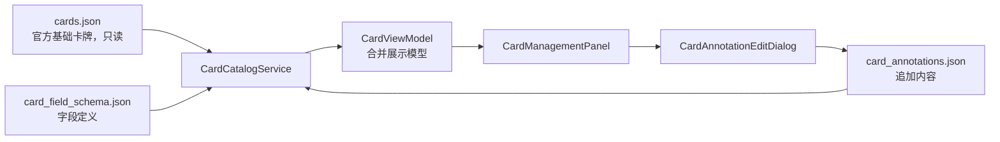

# 对局卡牌管理需求规格

> 状态：已开发（首版）
>
> 范围：基础对局卡牌浏览、配置化追加字段、版本化加强/削弱效果管理
>
> 不包含：基础卡牌编辑、实时牌局追踪、卡牌 OCR、AI 自动生成效果或对局胜率预测

## 一、目标与成功标准

### 1.1 目标

提供一个独立的“对局卡牌”管理功能，统一浏览官方基础卡牌，并在不改变官方基础资料的前提下，持续维护随版本或玩法变化产生的加强、削弱及其他补充信息。

### 1.2 成功标准

- 用户可检索、筛选并阅读所有有效基础卡牌及其规则详情。
- 任何卡牌追加信息的创建、修改、归档都不得改写 `data/cards.json`。
- 初始“加强效果”“削弱效果”支持多条历史记录、版本与生效时间追溯。
- 新增、停用、归档追加字段后，已有历史数据可恢复、可查看且不丢失。
- 基础资料、追加字段定义或单条追加内容异常时，其他可用数据仍可浏览或编辑。

## 二、现状、前置假设与边界

### 2.1 当前基础数据

`data/cards.json` 当前包含 49 张基础卡牌：行动牌 7 张、战法牌 16 张、装备牌 26 张。每条记录包含：

| 字段 | 含义 | 编辑权限 |
|---|---|---:|
| `id` | 官方卡牌唯一 ID | 只读 |
| `name` | 卡牌名称 | 只读 |
| `card_type` | 行动牌、战法牌、装备牌等类型 | 只读 |
| `card_desc` | 简短效果描述 | 只读 |
| `card_detail` | 规则详解 | 只读 |
| `card_amount` | 牌堆数量 | 只读 |

现有 `Card` Pydantic 模型会将来源中字符串形式的 `card_amount` 校验转换为整数。该转换仅用于内存视图；本功能不得因类型转换、排序或展示需要而覆盖基础 JSON。

### 2.2 设计边界

1. `cards.json` 是官方基础快照，UI、服务和普通数据管理操作均不得提供新增、编辑、删除入口。
2. 追加信息必须与基础卡牌物理分离，按 `card_id` 关联，不能嵌入或回写到基础文件。
3. 字段定义可配置，但字段 key 一旦创建不可修改；禁止以任意脚本、表达式或动态代码作为字段类型。
4. 加强、削弱等版本变更使用追加式历史记录，不覆盖旧记录。
5. 首版不从武将攻略自动推断相关卡牌；对局攻略集成属于后续能力。

## 三、数据模型与持久化

### 3.1 文件结构

```text
data/
├── cards.json                    # 官方基础卡牌，只读
├── card_field_schema.json        # 追加字段定义，可编辑
└── card_annotations.json         # 各卡牌追加字段值，可编辑
```

两份可写文件必须使用 UTF-8、无 BOM、LF 换行，并采用临时文件替换进行原子保存。

### 3.2 追加字段定义

初始内置字段为“加强效果”和“削弱效果”，但它们以默认配置写入字段定义文件，不作为 UI 或 Python 模型中的硬编码专用字段。

```json
{
  "schema_version": 1,
  "fields": [
    {
      "key": "strengthen_effect",
      "label": "加强效果",
      "value_type": "effect_entries",
      "group": "版本调整",
      "enabled": true,
      "required": false,
      "display_order": 10,
      "help_text": "记录该卡牌在特定版本或玩法中的加强内容。"
    },
    {
      "key": "weaken_effect",
      "label": "削弱效果",
      "value_type": "effect_entries",
      "group": "版本调整",
      "enabled": true,
      "required": false,
      "display_order": 20,
      "help_text": "记录该卡牌在特定版本或玩法中的削弱内容。"
    }
  ]
}
```

首版支持的字段类型：

| 类型 | 值格式 | 用途 |
|---|---|---|
| `effect_entries` | 版本化效果记录列表 | 加强、削弱、规则调整 |
| `markdown` | 多行文本 | 裁定备注、使用技巧 |
| `tags` | 字符串列表 | 效果标签、玩法标签 |
| `boolean` | 布尔值 | 稳定属性开关 |
| `number` | 数值 | 计数、权重、阈值 |
| `select` | 预定义选项之一 | 适用模式、维护状态 |

字段定义校验规则：

- `key` 使用小写英文字母、数字和下划线，创建后不可修改，且全局唯一。
- `label`、帮助文本、分组、显示顺序、启用状态可修改。
- 已有数据引用的字段只能归档，不能物理删除；归档字段不出现在新建表单，但历史值仍可见。
- `select` 必须至少定义一个非空选项；`display_order` 为整数。

### 3.3 卡牌追加内容

```json
{
  "schema_version": 1,
  "annotations": [
    {
      "card_id": "8",
      "fields": {
        "strengthen_effect": [
          {
            "version": "2026.08",
            "effective_from": "2026-08-01",
            "effective_to": null,
            "content": "效果说明。",
            "source": "官方公告或人工确认备注",
            "status": "active"
          }
        ],
        "weaken_effect": [],
        "tactical_tags": ["基础输出"]
      },
      "updated_at": "2026-07-26"
    }
  ]
}
```

`effect_entries` 的每条记录必须包含版本、开始日期、正文和状态；结束日期、来源可为空。状态仅允许 `active`、`expired`、`pending`。同一张卡、同一追加字段内，时间区间重叠的两条记录不能同时为 `active`。

## 四、架构与职责



| 组件 | 职责 | 禁止行为 |
|---|---|---|
| `CardRepository` | 只读加载、校验、搜索基础卡牌 | 更新、删除、保存基础卡牌 |
| `CardFieldSchemaRepository` | 管理字段定义及其校验 | 修改已有字段 key |
| `CardAnnotationRepository` | 管理卡牌追加内容、原子保存 | 写入 `cards.json` |
| `CardCatalogService` | 合并三类数据、生成稳定视图模型 | 持有 QWidget 或直接操作 UI |
| `CardManagementPanel` | 页面状态、筛选、渲染和发射编辑请求 | 直接读写 JSON |
| `CardAnnotationEditDialog` | 编辑单张卡的追加字段值 | 编辑基础字段 |
| `CardFieldSchemaDialog` | 管理字段定义 | 修改基础卡牌 |

所有可写操作通过 Repository/Service 执行；服务层不得持有 Qt 控件引用。

## 五、界面与交互

### 5.1 页面入口与总体布局

卡牌功能不作为独立主窗口 Tab。现有“武将浏览”升级为主级入口“资料库”，并在其内部提供“武将资料”和“卡牌图鉴”两个二级 Tab；现有武将浏览功能迁入“武将资料”，行为不变。

```text
主窗口
├─ 资料库
│  ├─ 武将资料
│  └─ 卡牌图鉴
├─ 选将推荐
└─ 对局攻略
```

日常入口名称使用“卡牌图鉴”，而不是“卡牌管理”，突出查阅规则和版本信息的主要用途。“管理追加字段”是卡牌图鉴右上角的次级操作，面向维护者而非常规浏览用户。页面使用“左侧列表 + 右侧详情”布局。

```text
┌ 资料库 > 卡牌图鉴  共 N 张 · 官方基础数据只读     [管理追加字段] ┐
│ [搜索卡牌] [全部类型▼] [仅看有版本调整] [清除筛选]               │
├──────────────────────┬───────────────────────────────────────────┤
│ 卡牌列表（30%）      │ 卡牌详情（70%）                            │
│ 行动牌 / 战法牌 / 装备牌 │ [锁] 官方基础资料（只读）              │
│ 名称、类型、调整状态 │ 名称、类型、牌堆数量、简述、规则详解      │
│                      │ ───── 追加信息 / 版本调整 ─────           │
│                      │ 加强效果、削弱效果、其他启用字段          │
└──────────────────────┴───────────────────────────────────────────┘
```

页面显示规则：

- 官方基础区域必须显示锁图标和“官方基础数据，只读”说明。
- 规则详解放入可滚动区域；追加字段使用独立卡片，不与规则正文混排。
- 加强效果使用绿色强调、削弱效果使用橙/红色强调；颜色不是唯一表达方式，标题文本必须保留。
- 卡牌类型仅作为分类标签，不用于表达强弱或版本状态。
- 不在“数据”菜单中提供日常卡牌浏览入口；该菜单仅保留导入、配置等维护型操作。

### 5.2 浏览与筛选

- 支持按卡牌 ID、名称、简述、规则详解、追加字段内容搜索。
- 支持按卡牌类型筛选：行动牌、战法牌、装备牌及未来模型支持的类型。
- 支持“仅有加强效果”“仅有削弱效果”“存在生效中调整”“存在待核实记录”筛选。
- 列表先按基础卡牌类型分组，组内按基础 ID 的稳定顺序排列；追加内容不得改变基础排序。
- 没有选择卡牌时显示空详情引导；没有搜索结果时显示可清除筛选的空状态。

### 5.3 追加内容编辑

点击“新增/编辑”仅打开追加字段编辑对话框。对于 `effect_entries`，表单包含：

| 字段 | 规则 |
|---|---|
| 调整类型 | 使用当前字段定义的标签，只读展示当前字段 |
| 版本 | 必填，最长 32 字符 |
| 生效开始日期 | 必填，合法日期 |
| 生效结束日期 | 可空；不早于开始日期 |
| 效果说明 | 必填，多行文本 |
| 来源 | 可空，官方链接或人工确认备注 |
| 状态 | `active`、`expired`、`pending` |

- 新记录以追加方式保存，不得覆盖旧版本记录。
- 同字段的 `active` 记录发生时间重叠时，阻止保存并指出冲突记录。
- 删除已保存记录应改为“归档/失效”；取消未保存草稿不产生数据变更。
- 编辑成功后只刷新当前卡片的追加区和筛选状态，不重建基础卡牌库。

### 5.4 追加字段管理

“管理追加字段”打开独立对话框，支持新增字段、修改可变属性、调整顺序、启用/停用和归档。

- 新建字段必须先选择字段类型，再显示对应的配置表单。
- 修改字段类型仅允许在该字段尚无任何值时执行；已有值时提示先新建迁移字段。
- 归档字段在详情页的“历史字段”区域只读展示，在新建或编辑表单中隐藏。
- 首版不提供批量导入、批量删除或自由公式计算功能。

## 六、异常、权限与一致性

| 情况 | 系统行为 |
|---|---|
| 基础文件缺失或整体无效 | 禁用追加编辑，显示“基础卡牌库不可用”与错误原因 |
| 单条基础卡牌无效 | 跳过该条、记录加载问题，其余基础卡牌可用 |
| 字段定义整体无效 | 基础浏览正常；追加区显示配置错误，不允许编辑 |
| 单个字段定义无效 | 跳过无效字段，显示配置警告，其余字段可用 |
| 追加内容引用未知卡牌 | 作为孤儿记录保留，不显示在卡牌详情，字段管理页提示处理 |
| 追加内容引用归档字段 | 在历史字段区只读展示，不丢失 |
| JSON 文件被占用或保存失败 | 保留编辑对话框草稿、提示重试，不破坏旧文件 |
| 基础库更新导致名称变化 | 仍按 `card_id` 关联，历史追加内容不受名称变化影响 |

追加字段与内容文件加载遵循只读恢复原则：加载时不得自动清理、修复或覆盖源文件；问题记录日志并向 UI 提供可读状态。

## 七、与其他功能的关系

首版卡牌管理是独立浏览与维护能力，不向对局攻略页面自动推送结论。后续若接入对局攻略：

- 只能根据可靠的卡牌名关联或明确关系数据展示“相关卡牌”。
- 优先展示当前生效的加强/削弱记录，并可跳转到卡牌详情。
- 无可靠关联时不展示猜测性推荐。
- 对局攻略中的“相关卡牌”应为折叠式只读区，点击后导航至“资料库 > 卡牌图鉴”的对应卡牌。
- 卡牌图鉴仍是唯一编辑入口；对局攻略只读展示。

## 八、验收标准

### 8.1 基础资料保护

- 基础卡牌可完整加载、搜索、按类型筛选、查看简述和规则详解。
- UI、服务与 Repository 均不存在编辑、删除、新增基础卡牌的公开入口。
- 任意追加字段编辑后，`cards.json` 内容和字节序列保持不变。

### 8.2 追加字段与版本记录

- 默认“加强效果”“削弱效果”均可为任意卡牌追加多条版本记录。
- 字段 key 重复、非法 key、非法字段类型、无效枚举值、日期区间无效均被拒绝。
- 两条生效中记录时间重叠时，保存被阻止并定位冲突。
- 新增、停用、归档字段后，已保存数据不丢失；归档字段仅在历史区域展示。

### 8.3 容错与稳定性

- 单条基础卡牌、单个字段定义或单条追加内容异常时，其余有效数据仍可使用。
- 保存失败不覆盖原文件，重新打开编辑对话框前草稿仍保留在当前会话。
- 相同基础卡牌、字段定义与追加内容输入下，列表排序、当前生效记录和历史顺序完全稳定。
- 所有可写 JSON 均验证 UTF-8、无 BOM、LF 换行，并通过临时文件替换保存。

## 九、后续迭代

- 追加字段模板导入/导出与字段迁移助手。
- 官方公告导入后生成待核实的版本调整草稿。
- 卡牌图片、花色、点数及装备槽位等基础资料的只读补充。
- 对局攻略中的可靠卡牌关联与快捷跳转。
- 基于当前局面手牌、武将技能和规则的临场卡牌提示；该能力需要独立定义数据来源与可信度边界。
